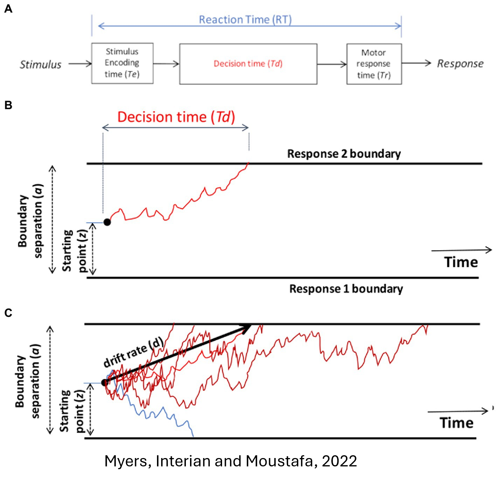

# Modelling Differences in Self-referential Decision-making Process in Depression and Anxiety

  

Depression and anxiety are characterized by negative biases in self-perception, which are often measured via the Self Referent Encoding Task (SRET) and modelled using drift-diffusion models (DDM). The current study involved 57 adults who performed the SRET to assess social anxiety, fear of evaluation, depression self-esteem, and general anxiety. The task used 48 adjectives balanced for positive/negative valence and for interpersonal affiliation and dominance. The participants made yes/no self-descriptiveness decisions, and responses and reaction times were recorded. We fitted hierarchical DDMs to each word category’s binary choices and reaction times, estimating three key parameters: drift rate (v), decision threshold (a), and starting point bias (z). Our analysis examined how these parameters differed for positive vs negative adjectives and for high vs. low affiliation and dominance adjectives, and how they related to depression and anxiety scores. We found that negative-valence adjectives generally elicited slower drift toward endorsement and/or faster drift toward rejection, consistent with a negative bias in depressed and anxious individuals. Additionally, participants with higher depression scores tended to require more evidence (higher a) or exhibited slower drift for rejecting negative adjectives, whereas anxiety scores were linked to different parameter changes. These results align with prior DDM findings in internalizing disorders and suggest that drift, boundary, and bias metrics could help distinguish depressive vs. anxiety processing biases. Clinical implications include the potential use of DDM-derived indices of self-referential processing as markers for distinguishing depression and anxiety.
